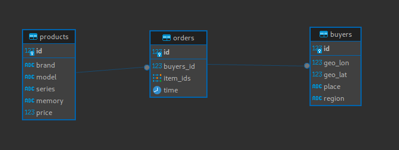
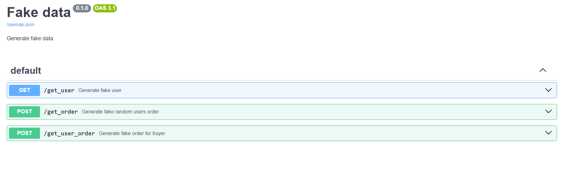
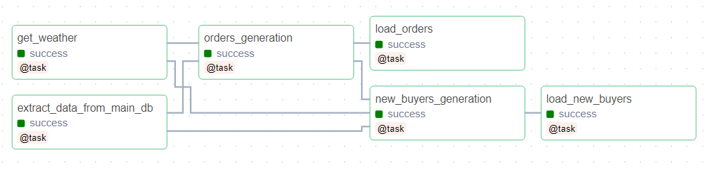
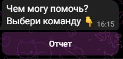
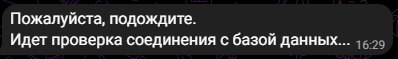
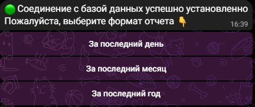
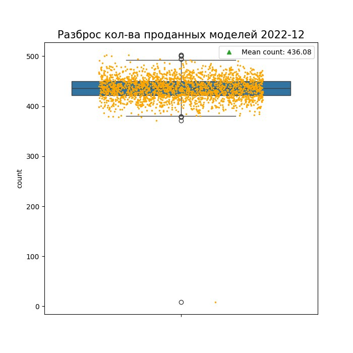
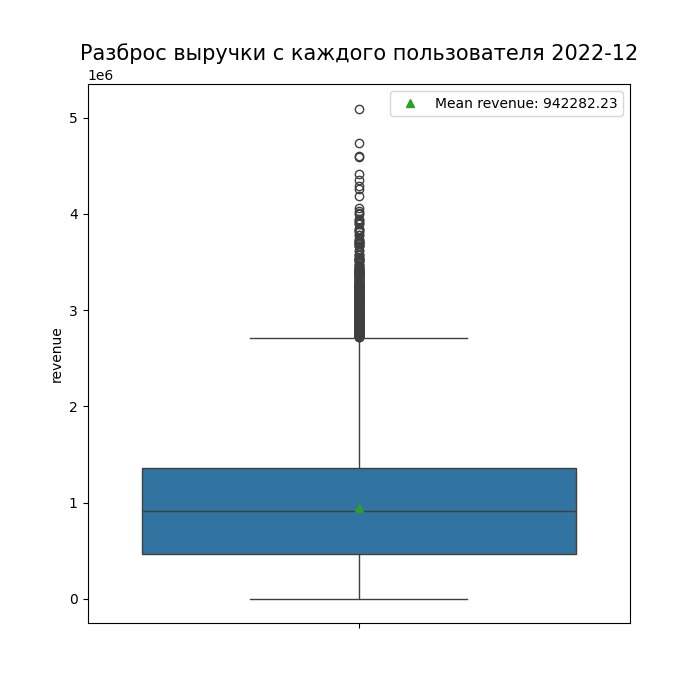
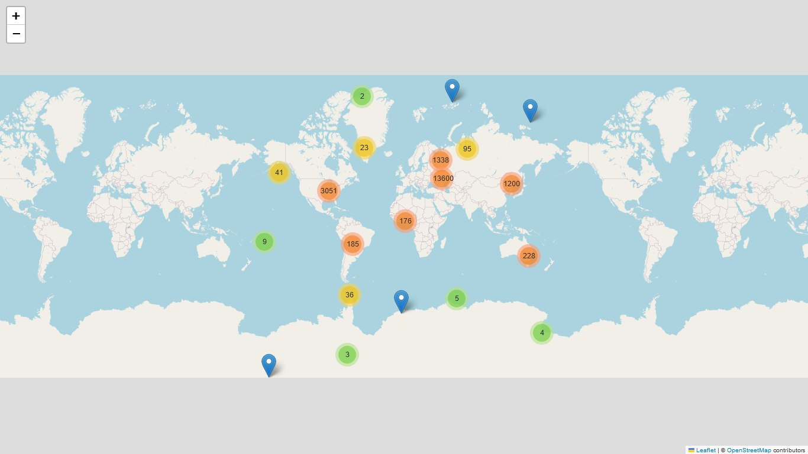

# Модульный проект по симуляции магазина телефонов.

## 1. Сбор данных, формирование базы данных:
<p align="center">
  
</p>

* **Сбор точек интересса** (Для таблицы: buyers). Для сбора точек интересы было написано пару парсеров с использованием
`requests` и `BeatifulSoup`. Удалось вытащить `1014912` точек интереса.
* **Сбор данных о смартфонах** (Для таблицы: products). Для сбора информации о смартфонах были написаны пару парсеров
с использованием `requests` и `BeatifulSoup`. Собранно `2310` моделей смартфонов. На первичную обработку данных можно 
посмотреть во 2 модуле (EDA).
* **Генерация знаказов** (Для таблицы orders, `на данный момент ~73млн записей`). Начальный способ генерации:
  * Пользователь выбирается случайным образом из всех;
  * Для каждого пользователя случайным образом отбирается от 1 до 25 шт. случайных id товаров (смартфонов);
  * Дата выбирается случайным образом в диапазоне ('01-01-2017 00:00:00' - '01-01-2023 00:00:00').
* **В дальнейшем способ генерации был изменен, смотреть `3` и `4` модули.**

## 2. EDA анализ собранных данных:
<p align="center">
  
</p>

* Ссылка: https://github.com/Shazy021/EDA_tdata

В этом модуле содержатся различные этапы исследований, связанные с собранными данными. Каждый из ноутбуков нацелен
на закрепления навыков работы с определенными инструментами предназначенных для решения задач и проблем, связанных
с анализом данных.

## 3. Faker API:
<p align="center">
  
</p>

* Ссылка: https://github.com/Shazy021/Faker-API

Данное API предназначено для генерации фейковых данных. Оно использует `FastAPI` - быстрый и современный
фреймворк для создания веб-приложений на языке `Python`. За счет использования `FastAPI`, API обладает 
высокой производительностью и простотой в использовании.

API предлагает несколько эндпоинтов для генерации различных видов фейковых данных.
Они включают в себя генерацию фейкового пользователя, случайного заказа для случайного пользователя и 
фейкового заказа для указанного пользователя.

Для удобства использования и развертывания, API может быть запущено в контейнере `Docker`.
Вместе с кодом API, в репозитории предоставлен `Dockerfile` и `docker-compose.yml` для упрощенной настройки и запуска.

## 4. Airflow DAG:

<p align="center">
  
</p>

* Ссылка: https://github.com/Shazy021/DAG-for-Tbot

Основная цель этого DAG - имитация различных сезонных колебаний спроса и тестирование системы обработки заказов на различных нагрузках. 
За счет динамического вычисления коэффициентов на основе текущей даты и данных о 
погоде, количество генерируемых фейковых заказов может меняться в зависимости от 
условий. Это позволяет создавать и тестировать сценарии с разными уровнями спроса и 
нагрузки, чтобы оценить производительность и эффективность системы обработки заказов, 
а также закреплению навыков по обработке и анализу больших данных.

***
# О боте (Tbot)

Данный Telegram бот является частью модульного проекта симуляции работы магазина
по продаже телефонов и служит для формирования/отправки отчетов.

***
## Установка

1. Клонируйте репозиторий.

   ```
   git clone https://github.com/Shazy021/tele_bot.git
   ```
   
2. Создайте виртуальную среду и активируйте ее.

   ```
   python3 -m venv env
   source env/bin/activate
   ```
   
3. Установите пакеты Python.

   ```
   pip install -r requirements.txt
   ```
   
4. Настроить Telegram-бота.

   - Поговорите с BotFather в Telegram и создайте нового бота.
   - Скопируйте токен бота.
   - Создайте файл с именем `.env` в каталоге проекта со следующей структурой:
   
      ```
      BOT_TOKEN = <bot_token>
      
      DB_USER = 'shazy'
      DB_IP = '192.168.0.1:1111'
      DB_PASSWORD = '0000'
      ```
      
      Замените `<bot_token>` скопированным токеном бота.

## Запуск

1. Запустите бота.

   ```
   Python main.py
   ```
   
2. Откройте Telegram и найдите своего бота.

3. Введите команду `/start`, после чего вы увидете приветственое сообщение 
и кнопку с переходом на следующий шаг.

<p align="center">
  
</p>

## Отчет

При нажатии на кнопку отчета, произойдет попытка соединения с базой данных (подключение к бд идет через `SparkSession`, использую `JDBC postgresql driver ver-42.6.0`):

<p align="center">
  
</p>

В зависимости от успеха, телеграмм бот уведомит вас соответствующим сообщением.

В случае неудачи:

<p align="center">
  
</p>

В случае успеха бот пришлет сообщение с выбором формата для подготовки отчета:

<p align="center">
  
</p>

### Пример отчета:
<p align="center">
  
</p>

<p align="center">
  
</p>

<p align="center">
  
</p>

***
